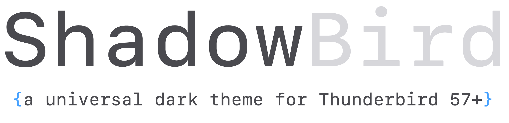
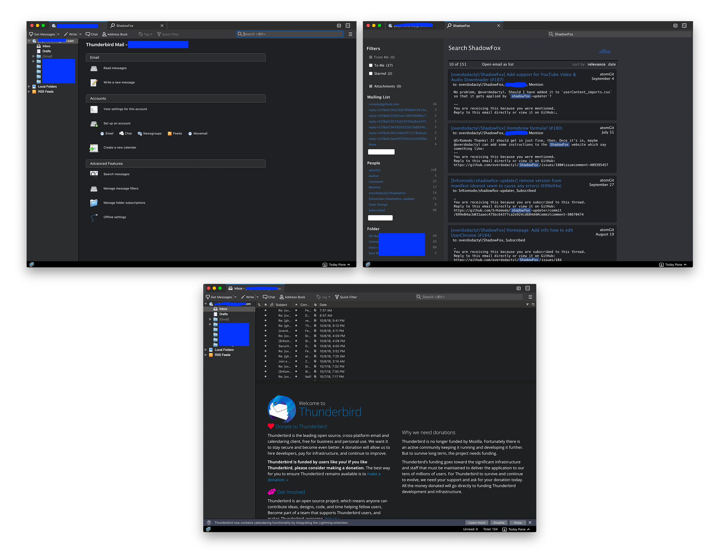

ShadowBird is a spinoff of [ShadowFox](https://overdodactyl.github.io/ShadowFox/) ([GitHub Link](https://github.com/overdodactyl/ShadowFox)), a universal dark theme for Firefox 57+, designed for Thunderbird.  

This project is early in development and users are encouraged to open issues or pull requests with any problems, enhancements or feature requests.  

## Preview




## Installation

0. Enable the default dark theme (Tools > Add-ons > Theme > Dark)

1. Set `toolkit.legacyUserProfileCustomizations.stylesheets` to `true` in the Config Editor ( →  Preferences → End of page, at the bottom)

1. Download this repository and rename the folder to `chrome`.

1. Place the `chrome` folder inside your Thunderbird profile directory. To find your profile directory, you can do the following from within Thunderbird:

	- Help > Troubleshooting Information > Application Basics section > Profile Folder > Show in Finder

1. (Optional) To change the background and text area of the message composition pages, you can dd the following lines to your `user.js` file within the profile directory (this will not alter the appearance of sent messages):

	```js
	user_pref("browser.display.foreground_color", "#b1b1b3");
	user_pref("browser.display.background_color", "#38383d");
 	```
	
	The `user.js` does not exist be default; you will have to create the file (name and case sensitive) if you haven't done so in the past. 

1. Restart Thunderbird
